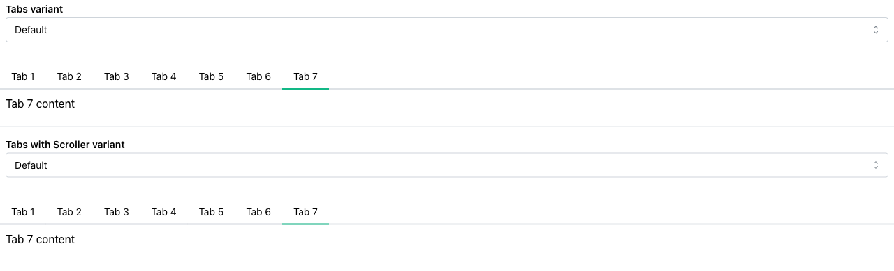
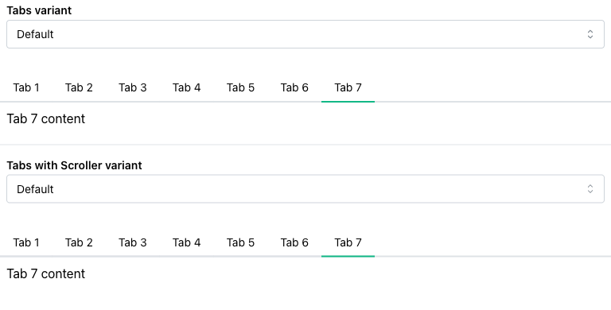
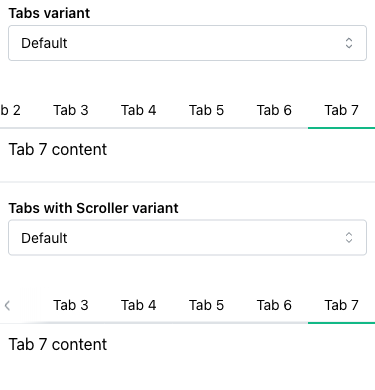

# Mantine Scrollable Tabs

Responsive tabs examples built with [Mantine](https://mantine.dev/):
- `Tabs` based on Mantine `Tabs` and keeps the active tab visible with a shared scroll hook. Read more: [Tabs component with scrolling support](https://medium.com/@dipiash/tabs-component-with-scrolling-support-2fbf128c078d);
- `TabsWithScroller` preserves the same but using Mantine `Scroller`.

## Screenshots

| Desktop · 1280 px                                                                                                           | Tablet · 768 px                                                                                                          | Mobile · 375 px                                                                                                          |
|-----------------------------------------------------------------------------------------------------------------------------|--------------------------------------------------------------------------------------------------------------------------|--------------------------------------------------------------------------------------------------------------------------|
| [](docs/screenshots/tabs-with-scroller-desktop.png) | [](docs/screenshots/tabs-with-scroller-tablet.png) | [](docs/screenshots/tabs-with-scroller-mobile.png) |

## Run locally

```bash
npm install
npm run dev
```

Requires Node.js `20.19+` or `22.12+`.
